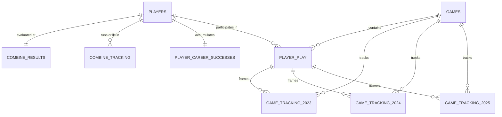
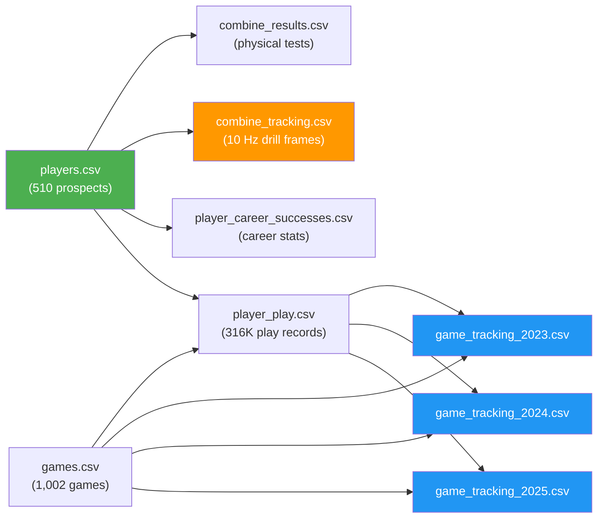

# Data Catalog

## File Inventory

| File Name | Size | Rows | Columns | Primary Keys / Description |
|-----------|------|------|---------|---------------------------|
| `players.csv` | 47 KiB | 510 | 10 | `nfl_id` — Rookie prospect metadata |
| `combine_results.csv` | 41 KiB | 510 | 18 | `nfl_id` — Combine testing splits & scores |
| `combine_tracking.csv` | 79.9 MiB | 463,189 | 14 | `event_id`, `nfl_id`, `time` — 10 Hz drill tracking |
| `player_career_successes.csv` | 14 KiB | 510 | 9 | `nfl_id` — Career volume stats & honors |
| `player_play.csv` | 139.3 MiB | 316,338 | 64 | `game_id`, `play_id`, `nfl_id` — Per-play NGS metrics |
| `games.csv` | 43 KiB | 1,002 | 7 | `game_id` — Schedule metadata |
| `game_tracking_2023.csv` | 319.9 MiB | 1,421,805 | 12 | `game_id`, `play_id`, `nfl_id`, `time` |
| `game_tracking_2024.csv` | 684.7 MiB | 3,042,118 | 12 | `game_id`, `play_id`, `nfl_id`, `time` |
| `game_tracking_2025.csv` | 975.2 MiB | 4,339,021 | 12 | `game_id`, `play_id`, `nfl_id`, `time` |

**Total:** ~2.2 GiB · 510 prospects · Draft years 2023–2025

---

## Entity Relationship Diagram

---

## Conceptual Data Flow

---

## Data Split by Side

### Combine Side (Pre-Draft)
- `players.csv` — Who they are
- `combine_results.csv` — How they tested (traditional metrics + NGS scores)
- `combine_tracking.csv` — How they moved during drills (10 Hz sensor data)

### NFL Side (Post-Draft)
- `games.csv` — When/where they played
- `player_play.csv` — What they did each snap (64 columns of NGS metrics)
- `game_tracking_*.csv` — How they moved during games (10 Hz sensor data)
- `player_career_successes.csv` — Career outcomes (snaps, starts, All-Pro, Pro Bowl)

---

## Notable Data Characteristics

> [!NOTE]
> - **6,310 Combine drill attempts** across all prospects
> - **316,338 player-play records** across 3 NFL seasons
> - **~8.8M game tracking frames** total across 2023–2025
> - Combine drills include: `FORTY_YARD_DASH`, `THREE_CONE_DRILL`, `SHORT_SHUTTLE`, `SKILL_DRILLS_WR`, `SKILL_DRILLS_DB`, `SKILL_DRILLS_OL`, `SKILL_DRILLS_DL`, `SKILL_DRILLS_TE`
> - Some combine tests have `null` values (opt-outs): `three_cone`, `short_shuttle`, `bench_reps`
> - `draft_round`, `draft_pick_within_round`, `draft_overall_pick` are `null` for UDFAs
